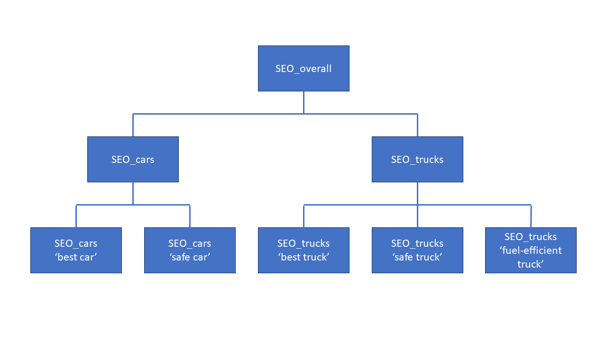

########
Examples
########

*************************************************
Product Management and Development Teams Workflow
*************************************************

Let us use the same SEO example used in the :doc:`introduction <intro>` section but put actual actions and numbers on it. Imagine we have a company from the automobile industry. The company has two product lines: cars and trucks. Trucks are more important than cars for the company business. Key selling point for company products is safety. Plus, trucks are also known to be fuel-efficient.

Here is how the work could evolve between product management and development teams. Since the problem at hand is SEO, the development team is probably from marketing department.

.. _metrics-hierarchy:

Step 1. Define Hierarchy of Metrics
===================================

The organization has two product lines, so let us assume it has two separate landing pages marketing to different customer bases. The product management decides which search terms are important, so they resonate well with targeted customers. For this example, it may look like this:

* For 'car' landing page: 'best car', 'safe car'
* For 'trucks' landing page: 'best truck', 'safe truck', 'fuel-efficient truck'

Together this produces the following hierarchy of metrics:

Step 2. Define Normalized Lowest-Level Metrics
==============================================

Let us assume that the current results for search terms are:

* 'best car': not found in top ten search results.
* 'safe car': 8\ :sup:`th` on the list of search results.
* 'best truck': 8\ :sup:`th` result.
* 'safe truck': 5\ :sup:`th` result.
* 'fuel-efficient truck': not found in top ten search results.

Per ``facere-sensum`` rules this needs to be normalized so that metric values are between ``0`` and ``1``. Product management decides that lowest-level metric is defined as ``1`` if the landing page shows up first in search results, ``0.9`` if it shows up second and so forth. The metric becomes ``0`` if the landing page is not found in the top ten search results. This yields the following current metric values for the lowest level of the picture above:

.. math::

   SEO_{bestcar} = 0; SEO_{safecar} = 0.3

   SEO_{besttruck} = 0.3; SEO_{safetruck} = 0.6; SEO_{fuelefficienttruck} = 0

Let assume that all these metrics created equal from the SEO success perspective and the company believes that being 6\ :sup:`th` on the list of search results for each of them individually is good enough. Being 6\ :sup:`th` would translate to normalized value of ``0.5``. We see that SEO\ :sub:`safetruck` individually is doing well, but not the other metrics.

In the real world you'd probably want to set a higher bar for key selling point metrics like SEO\ :sub:`safecar` or SEO\ :sub:`safetruck` and for these two specifically make being 2\ :sup:`nd` or 3\ :sup:`rd` search result correspond to metric value of ``0.5``. We will refrain from that in this example to keep things simple. Notice, however, that lowest-level metrics do not need to use same scheme and can be defined individually. What matters is that in the end they have a value between ``0`` and ``1`` with the midpoint being 'successful' performance from the business perspective.

Step 3. Define Weights for Calculating Higher-Level Metrics
===========================================================

The product management decides that:

* For SEO\ :sub:`overall`: since trucks business is more important than cars SEO\ :sub:`trucks` gets a weight of ``0.7`` and hence SEO\ :sub:`cars` gets the remaining weight of ``0.3``.
* For SEO\ :sub:`cars`: safety is a key selling point, so SEO\ :sub:`safecar` gets a weight of ``0.8`` and hence SEO\ :sub:`bestcar` get the remaining weight of ``0.2``.
* Similarly for SEO\ :sub:`trucks`: SEO\ :sub:`safetruck` gets a weight of ``0.5``, SEO\ :sub:`fuelefficienttruck` gets ``0.3`` and SEO\ :sub:`besttruck` gets remaining ``0.2``.

Given these weights and current lowest-level metric values we are getting the following current values for higher level metrics, automatically computed by ``facere-sensum``:

.. math::

   SEO_{cars} &= SEO_{bestcar}*0.2 + SEO_{safecar}*0.8 \\
              &= 0*0.2 + 0.3*0.8 = 0.24

.. math::
   SEO_{trucks} &= SEO_{besttruck}*0.2 + SEO_{safetruck}*0.5 + SEO_{fuelefficienttruck}*0.3 \\
                &= 0.3*0.2 + 0.6*0.5 + 0*0.3 \\
                &= 0.06 + 0.3 = 0.36

.. math::
   SEO_{overall} &= SEO_{cars}*0.3 + SEO_{trucks}*0.7 \\
                 &= 0.24*0.3 + 0.36*0.7 \\
                 &= 0.072 + 0.252 = 0.324

Step 4. Set Goals for Metrics at the Appropriate Level
======================================================

Most of the lowest-level metrics (SEO\ :sub:`bestcar`, SEO\ :sub:`safecar`, SEO\ :sub:`besttruck` and SEO\ :sub:`fuelefficienttruck`) are below ``0.5`` success point, so the goals might be set for each of them individually to reach success. But that would be micromanagement. It is better to set higher-level goals.

All three higher-level metrics (SEO\ :sub:`cars`, SEO\ :sub:`trucks` and SEO\ :sub:`overall`) are below ``0.5`` as well. In this example, product management decides that just one goal will be set on the top level for the SEO\ :sub:`overall`. Currently is has the value of ``0.324``. The target is set for SEO\ :sub:`overall` to become ``0.5`` or higher which would indicate that the company generally improved SEO to a successful level across all its products.

Step 5. Understand If the Goal is Achievable
============================================

The marketing department concludes that there is some SEO webpage metadata / dark magic that can be applied to improve the search for 'safe car' and 'fuel-efficient truck' terms. Assuming that both can be optimized to become 5\ :sup:`th` search result and SEO is not getting worse for other terms, this is what we are looking at after potential improvement:

.. math::

   SEO_{bestcar} = 0; SEO_{safecar} = 0.6

   SEO_{besttruck} = 0.3; SEO_{safetruck} = 0.6; SEO_{fuelefficienttruck} = 0.6

.. math::

   SEO_{cars} &= SEO_{bestcar}*0.2 + SEO_{safecar}*0.8 \\
              &= 0*0.2 + 0.6*0.8 = 0.48

.. math::
   SEO_{trucks} &= SEO_{besttruck}*0.2 + SEO_{safetruck}*0.5 + SEO_{fuelefficienttruck}*0.3 \\
                &= 0.3*0.2 + 0.6*0.5 + 0.6*0.3 \\
                &= 0.06 + 0.3 + 0.18 = 0.54

.. math::
   SEO_{overall} &= SEO_{cars}*0.3 + SEO_{trucks}*0.7 \\
                 &= 0.48*0.3 + 0.54*0.7 \\
                 &= 0.144 + 0.378 = 0.522

This analysis shows that the goal is achievable. 

Step 6. Define Focus Areas and Track Execution
==============================================

We can see now that the goal of ``0.5`` is achievable by focusing SEO on improving search for two out of five search terms. Overall, this gives marketing department a goal, a way to track it, and a focus so that they know exactly which pieces of the equation they should work with.
